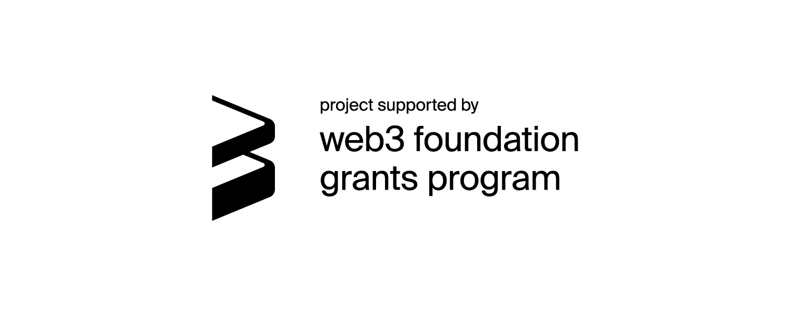

# APK verifier
Solidity verifier implementation for accountable light client. This project is [funded by the web3 foundation](https://github.com/w3f/Grants-Program/blob/master/applications/solidity-verifier-for-accountable-light-client.md).


## Overview
This repo holds two scheme apk verifier and associated libs:
- [Basic scheme verifier](./src/Basic.sol)
- [Packed scheme verifier](./src/Packed.sol)
- Libs
  * [BLS12-377](./src/common/bls12377)
  * [BW6-761](./src/common/bw6761)
  * [bytes](./src/common/bytes)
  * [math](./src/common/math)
  * [pcs](./src/common/pcs)
  * [piop](./src/common/piop)
  * [transcript](./src/common/transcipt)
  * [bitmask](./src/common/Bitmask.sol)

## Documentation
### Usage
To install with [**Foundry**](https://github.com/foundry-rs/foundry):
```sh
forge install darwinia-network/apk-verifier
```

### Install 
To install dependencies and compile contracts:
```sh
git clone --recurse-submodules https://github.com/darwinia-network/apk-verifier.git && cd apk-verifier
make tools
make
```
See inline code docs in the [book](https://darwinia-network.github.io/apk-verifier/)

## Testing and Testing Guide
### Dependencies
1. [Rust](https://www.rust-lang.org/tools/install)
```sh
curl --proto '=https' --tlsv1.2 -sSf https://sh.rustup.rs | sh
```
2. [Foundry](https://github.com/foundry-rs/foundry)
```sh
curl -L https://foundry.paradigm.xyz | bash
```
3. [Darwinia Node](https://github.com/darwinia-network/darwinia/tree/apk-verifier)
```sh
git clone https://github.com/darwinia-network/darwinia.git --branch apk-verifier
cargo build --release -p darwinia --features pangolin-native
```
4. Run darwinia node
```sh
./target/release/darwinia --chain pangolin-dev --alice --tmp --rpc-external --rpc-cors all --execution=native
```
5. Deploy basic/packed contract to local darwinia node
```sh
deploy-basic
deploy-packed
```
6. Contract deployed at last transaction hash.
7. Run test
```sh
make test-basic  ADDR=0x3ed62137c5DB927cb137c26455969116BF0c23Cb
make test-packed ADDR=0xeAB4eEBa1FF8504c124D031F6844AD98d07C318f
```
8. See the following results indicates that the test was successful.
```sh
0x0000000000000000000000000000000000000000000000000000000000000001
```

## Run Test in Docker
TODO

## License
